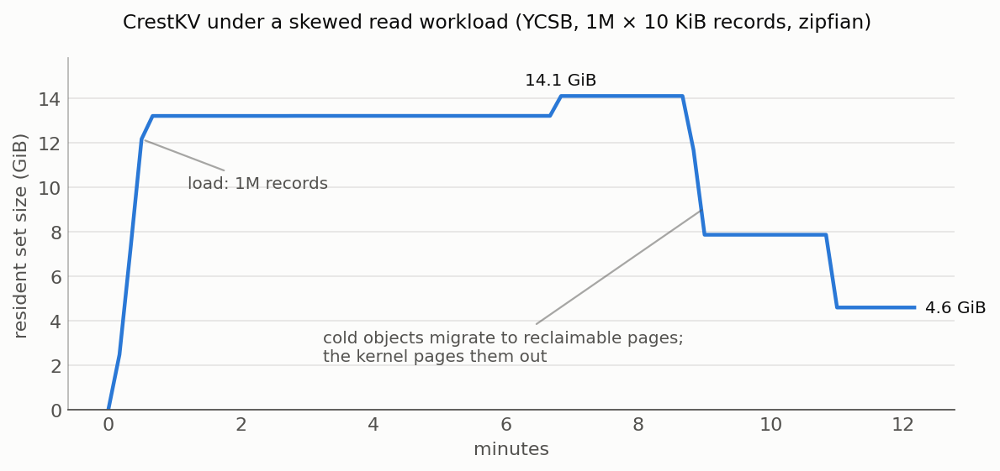

<div align="center">
<h1>Address Space Engineering</h1>
</div>

**Address space engineering** is the act of organizing an application's
virtual address space toward a specific goal — using less memory, improving
locality, or isolating tenants. Virtual memory gives each process freedom
over where its data lives, and most applications leave that freedom to the
allocator. Meanwhile, the operating system *only* makes decisions at page
granularity, leaving it blind to the application's intent and structure.

<div align="center">

[How OBASE works](#how-obase-works) · [Adopt it](#adopt-it-two-annotations) · [CrestKV](crest/) · [Research](#research)

</div>

**OBASE** — Object-Based Address-Space-Engineering - is a compiler and runtime 
mechanism that continuously relocate objects so hot
and cold data live on different pages — and [**CrestKV**](crest/), a
memory-efficient key-value store that adopts it across ten concurrent data
structures. Under skewed workloads, CrestKV gives up 2–5% throughput and
in exchange runs in up to 70% less resident memory.

## Pages are the wrong unit of placement

> "The OS page, while a convenient unit of translation and protection, is a
> poor unit of data placement."

Allocators place objects by size class and allocation order. The operating
system observes and reclaims memory in 4 KiB pages, using access bits that
cannot tell one hot object from four thousand cold bytes around it. When a
page holds even one hot object, the whole page looks hot — so the cold data
sharing it can never be reclaimed by a page based tiering system. 
We call this **hotness fragmentation**, and it is the measured
norm, not a corner case: 

- In Redis, 75% of accessed pages use **3% or fewer** of their bytes.
- Across six Google datacenter workloads, median page utilization is
  8–50%, and up to 97% of the bytes in active pages are cold yet
  unreclaimable.
- Scattering the same hot objects across pages costs up to 23× more TLB
  misses than clustering them.
- Meta and Twitter production traces show object hotness is neither
  predictable at allocation time nor stable afterward — no allocation-time
  placement policy can fix this. The layout has to adapt at runtime.

```
allocation order:  page 1 [ H c c c ]  page 2 [ c c H c ]   all pages look hot;
                                                            nothing reclaimable
engineered:        page 1 [ H H . . ]  page 2 [ c c c c ]   page 2 is cold;
                                                            the kernel can take it
```

## How OBASE works

OBASE engineers the address space by access intensity: objects with
similar temperature share pages. It is a *frontend* — it decides which
page each object lives on, and leaves tier placement to whatever
page-level *backend* is present (swap, TMO, TPP, AutoNUMA, Memtis). The
backends need no modification; they see pages that are uniformly hot or
uniformly cold, which is the input they were designed for. The layers
improve independently: a better frontend helps any backend, and vice
versa.

OBASE is our realization of this idea for unmanaged languages (C/C++),
where no runtime exists to move objects safely:

- **Guides** — tagged 64-bit pointers that add one level of indirection,
  making objects relocatable while threads run. The tag carries an access
  bit, a reference count, and the migration lock in the same word as the
  address; a dereference is one atomic read-modify-write with a
  skip-if-clean fast path.
- **Lightweight tracking** — a compiler inserts the access instrumentation;
  a background collector decays access bits each window and classifies
  objects hot or cold by observation.
- **Lock-free migration** — a two-CAS protocol relocates objects without
  pausing application threads: any concurrent dereference changes the guide
  word and thereby vetoes the in-flight migration. Hot objects cluster into
  a huge-page-backed region; cold objects into a region the collector
  releases with `MADV_PAGEOUT`.
- **Object Collector** - A garbage-collector collects invalid objects and 
reclaims memory. Similarly, the object collector sweeps the address space
to find cold/hot objects and migrate them to appropriate heaps/pages.

The full design — the migration protocol and the feedback controller that
decides when cold pages are released — is in the
[paper](https://www.usenix.org/conference/osdi26/presentation/banakar).

## Adopt it: two annotations

The developer's role is marking which pointer fields hold data worth
managing. Traversal pointers stay raw.

```cpp
struct Node {
    OBASE_GUIDED void *key;   // becomes Guide<void> key;
    OBASE_GUIDED void *val;   // becomes Guide<void> val;
    Node *next;               // traversal pointer: not annotated
};
```

A Clang rewriter converts the declarations and repairs the handful of casts
that stop compiling; everything else flows through operator overloads
unchanged. A validation pass runs on every build and rejects the usage the
runtime cannot support — pointer arithmetic across managed objects, raw
aliases of managed fields — instead of miscompiling it. Across CrestKV's
ten structures, each managed type carries one to three annotated fields.

To check that the conversion is faithful, we removed the hand-written
OBASE types from two of CrestKV's structures and regenerated them from
annotations; under identical workloads the regenerated structures are
behaviorally indistinguishable from the hand-written ones. The walkthrough
— annotating, converting, and wiring the runtime into your own application
— is in [docs/ADOPTING.md](docs/ADOPTING.md).

## CrestKV

[**CrestKV**](crest/) demonstrates address space engineering end to end: a
key-value server whose ten data structures — hash tables, skip lists,
B+ trees, a radix trie, spanning lock-free, fine-grained, and coarse
synchronization — are all OBASE-managed. Under a skewed read workload,
resident memory falls from 14.1 GiB to 4.6 GiB while the server keeps
serving. Without OBASE, the same workload continues consuming 14 GiB:



From the paper's evaluation (ten structures, six page-level backends, YCSB
plus Meta and Twitter production traces):

- Page utilization improves **2–4×**; memory footprint falls by **up to
  70%** when a reclaim backend is active.
- Throughput overhead is **2–5%** (2.5% average), with no upward trend
  from 2 to 32 threads — guide metadata is per-object, so there is no
  shared tracking state to contend on.
- Paired with unmodified backends (kswapd, TMO, TPP, Memtis), each reaches
  memory savings it cannot reach alone, because the pages it sees are
  uniform.
- Multi-hour Twitter/Meta replays show the feedback controller tracking
  shifting hot sets rather than thrashing.

The enabling condition is stated as plainly as the numbers: benefits come
from access skew. A uniformly hot dataset has nothing cold to segregate.

Everything CrestKV — building it, running it, the wire protocol, YCSB and
production-trace workloads — is in [crest/](crest/).

## Beyond memory savings

Tiering is the application we built and measured, but segregating an
address space by access intensity is a more general capability
(dissertation, chapter 7):

- **Garbage collection** — access intensity as a signal alongside the
  generational hypothesis: compact cold regions without disturbing hot
  ones; the classification policy transfers to managed runtimes, where the
  guide itself is unnecessary.
- **NUMA placement** — fault-sampling placement (AutoNUMA) becomes precise
  when pages are uniformly hot or cold: hot pages near the accessing node,
  cold pages anywhere.
- **Multi-tenant isolation** — enforce memory limits by reclaiming a
  tenant's cold regions first, so one tenant's pressure does not evict
  another's hot data.
- **Direct object tiering** — place objects straight onto DRAM, CXL, or
  byte-addressable storage from the frontend, collapsing the two-layer
  indirection where the added precision justifies managing tier
  characteristics explicitly.
- **Vector search indices** — relocate embeddings by observed query
  traffic while leaving the index structure (HNSW/IVF graphs, centroids,
  codebooks) untouched: placement adapts to the query distribution without
  rebuilding or re-partitioning the index.

## Status and limitations

This is a research prototype. It requires Linux with clang/LLVM-12+ and a
prefix-built jemalloc. Managed objects must be jemalloc-allocated and
singly-owned — structures that alias one node through multiple pointers
(shared graphs, doubly-linked lists) are out of scope. And the honest
caveat repeated from above: the memory savings are proportional to the
skew in the access pattern. CrestKV's own scope is described in
[crest/](crest/).

## Research

- **OBASE: Object-Based Address-Space Engineering to Improve Memory
  Tiering.** Vinay Banakar, Suli Yang, Kan Wu, Andrea C. Arpaci-Dusseau,
  Remzi H. Arpaci-Dusseau, Kimberly Keeton.
  [OSDI '26](https://www.usenix.org/conference/osdi26/presentation/banakar).
- **Tidying Up the Address Space.** Vinay Banakar, Suli Yang, Kan Wu,
  Andrea C. Arpaci-Dusseau, Remzi H. Arpaci-Dusseau, Kimberly Keeton.
  [SOSP DIMES'25](https://dl.acm.org/doi/10.1145/3764862.3768179).
- **Layout-Aware Data Organization for Heterogeneous Hierarchies.**
  Vinay S. Banakar. Ph.D. dissertation, University of Wisconsin–Madison,
  2026. [pdf](https://www.vinaybanakar.com/assets/pdf/vinay-dissertation.pdf).

```bibtex
@inproceedings {318399,
author = {Vinay Banakar and Suli Yang and Kan Wu and Andrea C. Arpaci-Dusseau and Remzi H. Arpaci-Dusseau and Kimberly Keeton},
title = {{OBASE}: {Object-Based} {Address-Space} Engineering to Improve Memory Tiering},
booktitle = {20th USENIX Symposium on Operating Systems Design and Implementation (OSDI 26)},
year = {2026},
isbn = {978-1-939133-55-7},
address = {Seattle, WA},
pages = {151--166},
url = {https://www.usenix.org/conference/osdi26/presentation/banakar},
publisher = {USENIX Association},
month = jul
}

@inproceedings{10.1145/3764862.3768179,
author = {Banakar, Vinay and Yang, Suli and Wu, Kan and Arpaci-Dusseau, Andrea C. and Arpaci-Dusseau, Remzi H. and Keeton, Kimberly},
title = {Tidying Up the Address Space},
year = {2025},
isbn = {9798400722264},
publisher = {Association for Computing Machinery},
address = {New York, NY, USA},
url = {https://doi.org/10.1145/3764862.3768179},
doi = {10.1145/3764862.3768179},
pages = {63–72},
numpages = {10},
keywords = {Memory Management, Memory Tiering, Object Management, Operating Systems, Virtual Address Space},
location = {Seoul, Republic of Korea},
series = {DIMES '25}
}

@PhdThesis{BanakarPhD2026,
  author =   {Vinay Banakar},
  title  =   "{Layout-Aware Data Organization for Heterogeneous Hierarchies}",
  school =   {University of Wisconsin, Madison},
  month  =   "Feb",
  year   =   {2026}
}
```
